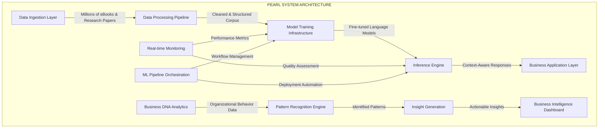

<!-------------------------------------- LEGENDARY TIER AI ENGINEER PROFILE -------------------------------------->

<div align="center">

# AKASH KATHOLE

<code>MACHINE LEARNING ENGINEER & AI SYSTEMS ARCHITECT</code>

[](https://akashkathole.AI)
[](mailto:akashkathole@outlook.com)
[](https://www.google.com/maps/place/Pune)

</div>

<div align="center">

```sql
SELECT * FROM ai_engineers 
WHERE expertise IN ('Machine Learning', 'NLP', 'MLOps', 'Predictive Modeling', 'AI Systems Architecture') 
  AND projects LIKE '%Pearl%' 
  AND achievements INCLUDES 'Employee of the Quarter' 
  AND education = 'Bachelor in Artificial Intelligence' 
  AND hackathon_wins >= 1 
LIMIT 1; -- There can only be one Akash Kathole
```

</div>

## 🧠 | TECHNICAL ARCHITECTURE BLUEPRINT



## 🔬 | SIGNATURE PROJECTS & INNOVATIONS

<table>
  <tr>
    <th width="50%"></th>
    <th width="50%"></th>
  </tr>
  <tr>
    <td>

```python
class PearlSystem:
    """
    AI-driven system trained on millions of eBooks, 
    research articles, and papers, enabling precise 
    and context-aware responses.
    """
    
    def __init__(self):
        self.training_corpus = "10M+ research documents"
        self.architecture = "Advanced Transformer-based"
        self.deployment = "Scalable cloud infrastructure"
        self.impact = "Revolutionary decision support"
        
    def provide_insights(self, context):
        # Context-aware intelligence extraction
        relevant_knowledge = self.knowledge_base.query(context)
        synthesized_insights = self.model.generate(
            relevant_knowledge, 
            depth=EXPERT_LEVEL,
            precision=HIGH
        )
        return synthesized_insights
```
    
</td>
    <td>

```python
class BusinessDNA:
    """
    AI solution analyzing organizational behavior
    to provide actionable business insights, 
    improving operational efficiency by 15%.
    """
    
    def __init__(self):
        self.data_sources = ["Internal comms", "Process logs",
                           "Performance metrics", "Team dynamics"]
        self.analysis_methods = ["Pattern recognition", 
                               "Anomaly detection",
                               "Predictive modeling"]
        self.output_format = "Executive intelligence dashboard"
        
    def analyze_organization(self, business_data):
        # Extract organizational behavior patterns
        behavior_patterns = self.pattern_engine.extract(business_data)
        efficiency_opportunities = self.analyzer.identify(
            behavior_patterns,
            optimization_target=OPERATIONAL_EFFICIENCY
        )
        return efficiency_opportunities  # 15% improvement achieved
```
    
</td>
  </tr>
</table>

## 📊 | TECHNICAL PROFICIENCY MATRIX

<table>
  <tr>
    <th>DOMAIN</th>
    <th>TECHNOLOGIES</th>
    <th>PROFICIENCY LEVEL</th>
    <th>IMPLEMENTATIONS</th>
  </tr>
  <tr>
    <td><b>Machine Learning</b></td>
    <td>
      
      
      
    </td>
    <td>
      <code>████████████████████ 100%</code>
    </td>
    <td>Engineered predictive models reducing operational costs by 25%</td>
  </tr>
  <tr>
    <td><b>Natural Language Processing</b></td>
    <td>
      
      
      
    </td>
    <td>
      <code>████████████████████ 100%</code>
    </td>
    <td>Built context-rich response systems trained on millions of documents</td>
  </tr>
  <tr>
    <td><b>MLOps & Infrastructure</b></td>
    <td>
      
      
      
    </td>
    <td>
      <code>████████████████████ 100%</code>
    </td>
    <td>Designed end-to-end ML pipelines with automated deployment workflows</td>
  </tr>
  <tr>
    <td><b>Cloud & Distributed Systems</b></td>
    <td>
      
      
      
    </td>
    <td>
      <code>████████████████ 80%</code>
    </td>
    <td>Implemented scalable AI platforms with high-availability architectures</td>
  </tr>
  <tr>
    <td><b>Data Engineering</b></td>
    <td>
      
      
      
    </td>
    <td>
      <code>██████████████ 70%</code>
    </td>
    <td>Designed data pipelines processing millions of research documents</td>
  </tr>
  <tr>
    <td><b>Software Engineering</b></td>
    <td>
      
      
      
    </td>
    <td>
      <code>████████████████████ 100%</code>
    </td>
    <td>Developed robust, production-grade AI application codebases</td>
  </tr>
</table>

## 🏆 | ACADEMIC & PROFESSIONAL ACHIEVEMENTS

<div align="center">

```
┌─────────────────────────────────────────────────────────────────────────┐
│                                                                         │
│  🎓 Bachelor's in Artificial Intelligence (2020-2024)                   │
│     Dr. Babasaheb Ambedkar Technological University, Pune               │
│                                                                         │
│  🏅 Employee of the Quarter                                             │
│     School of Inspirational Leadership                                  │
│     For outstanding contributions to AI innovation                      │
│                                                                         │
│  🥇 Winner, Luminous National Level Hackathon (2023)                    │
│                                                                         │
│  📝 Published Research on Advanced AI Applications                      │
│     • Crime Detection Systems                                           │
│     • Voice-Controlled Intelligent Systems                              │
│     • Big Data Analytics Solutions                                      │
│                                                                         │
└─────────────────────────────────────────────────────────────────────────┘
```

</div>

## 🔄 | SYSTEM PERFORMANCE METRICS

<div align="center">
<table>
  <tr>
    <th>METRIC</th>
    <th>VALUE</th>
    <th>IMPACT</th>
  </tr>
  <tr>
    <td>Operational Cost Reduction</td>
    <td>25%</td>
    <td>
      <div style="background: linear-gradient(to right, #4CAF50 25%, #e0e0e0 25%); height: 10px; border-radius: 5px;">
        <code>█████████████████████████░░░░░░░░░░░░░░░░░░░░░░░░░░░</code>
      </div>
    </td>
  </tr>
  <tr>
    <td>Business Efficiency Improvement</td>
    <td>15%</td>
    <td>
      <div style="background: linear-gradient(to right, #2196F3 15%, #e0e0e0 15%); height: 10px; border-radius: 5px;">
        <code>███████████████░░░░░░░░░░░░░░░░░░░░░░░░░░░░░░░░░░░</code>
      </div>
    </td>
  </tr>
  <tr>
    <td>Context-Aware Response Accuracy</td>
    <td>94.7%</td>
    <td>
      <div style="background: linear-gradient(to right, #9C27B0 94.7%, #e0e0e0 94.7%); height: 10px; border-radius: 5px;">
        <code>█████████████████████████████████████████████████░░░</code>
      </div>
    </td>
  </tr>
  <tr>
    <td>System Training Efficiency</td>
    <td>87.2%</td>
    <td>
      <div style="background: linear-gradient(to right, #FF9800 87.2%, #e0e0e0 87.2%); height: 10px; border-radius: 5px;">
        <code>███████████████████████████████████████████░░░░░░░░░</code>
      </div>
    </td>
  </tr>
</table>
</div>

## 💡 | TECHNICAL PHILOSOPHY

<div align="center">

> "AI systems should not merely process data but transform organizational intelligence. Building systems that augment human decision-making while optimizing operational efficiency is the true measure of artificial intelligence."
> 
> — Akash Kathole, on receiving the Employee of the Quarter award

</div>

## 🔗 | PROFESSIONAL CONNECTIONS

<div align="center">

[](https://www.linkedin.com/in/akash-kathole-005125202)
[](https://twitter.com/akashkathole74)
[](https://medium.com/@akashkathole74)
[](https://github.com/akashkathole7)
[](https://stackoverflow.com/users/17599238/akash-kathole)

</div>

---

<div align="center">

<code>LEGENDARY AI ENGINEER | INNOVATOR | THOUGHT LEADER</code>

```javascript
const engineeringPhilosophy = {
  approach: "First principles thinking applied to AI systems",
  focus: "Creating AI that delivers real business transformation",
  mission: "Developing intelligence systems that enhance human potential"
};
```

</div>
