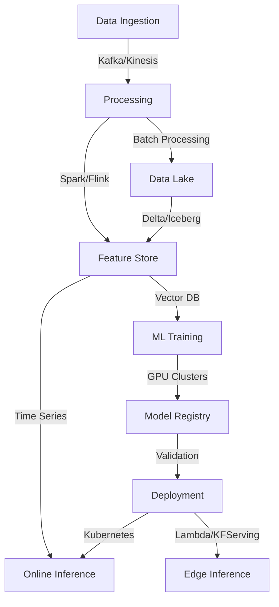

<!-- ADVANCED AI ENGINEER PROFILE - ULTRA PREMIUM VERSION -->

<div align="center">
  
# AKASH KATHOLE
  
[](https://akashkathole.AI)
[](https://akashkathole.AI)
[](https://akashkathole.AI)

```python
class AkashKathole:
    def __init__(self):
        self.name = "Akash Kathole"
        self.role = "AI Engineer & MLOps Specialist"
        self.location = "Global Remote"
        self.expertise = ["Deep Learning", "MLOps", "AI Systems Architecture", "Neural Networks"]
        self.languages = ["Python", "C++", "Julia", "R", "SQL"]
        self.interests = ["Cutting-edge AI Research", "Distributed Systems", "Neuromorphic Computing"]
    
    def get_project(self):
        return "Axona - Next-generation AI Platform"
    
    def contact(self):
        return "akashkathole74@gmail.com"
```

</div>

## 🧠 ADVANCED TECHNICAL EXPERTISE

### 📊 Data & Model Infrastructure


### 🛠 Advanced AI Engineering Stack

<table align="center">
  <tr>
    <th>Category</th>
    <th>Core Technologies</th>
    <th>Advanced Implementations</th>
  </tr>
  <tr>
    <td><strong>Foundation Models</strong></td>
    <td>
      <code>Transformers</code> • <code>BERT/RoBERTa</code> • <code>GPT Variants</code> • <code>T5</code> • <code>LLaMA</code>
    </td>
    <td>Fine-tuning, PEFT, RLHF, Model Distillation, Quantization</td>
  </tr>
  <tr>
    <td><strong>Computer Vision</strong></td>
    <td>
      <code>CNN Architectures</code> • <code>YOLO</code> • <code>Diffusion Models</code> • <code>NeRF</code> • <code>Swin Transformer</code>
    </td>
    <td>Multi-modal Vision Systems, Scene Understanding, Visual Reasoning</td>
  </tr>
  <tr>
    <td><strong>Databases & Vectors</strong></td>
    <td>
      <code>PostgreSQL</code> • <code>MongoDB</code> • <code>Neo4j</code> • <code>Pinecone</code> • <code>Weaviate</code> • <code>Chroma</code> • <code>Milvus</code>
    </td>
    <td>Multi-vector Indexing, Hybrid Search, Semantic Caching</td>
  </tr>
  <tr>
    <td><strong>MLOps</strong></td>
    <td>
      <code>MLflow</code> • <code>DVC</code> • <code>Kubeflow</code> • <code>Argo</code> • <code>Airflow</code> • <code>BentoML</code>
    </td>
    <td>CI/CD for ML, A/B Testing, Shadow Deployment, Monitoring & Observability</td>
  </tr>
  <tr>
    <td><strong>Distributed Computing</strong></td>
    <td>
      <code>Ray</code> • <code>Dask</code> • <code>Horovod</code> • <code>NCCL</code> • <code>DeepSpeed</code> • <code>Kubernetes</code>
    </td>
    <td>Multi-node Training, Parameter Servers, SPMD Patterns</td>
  </tr>
  <tr>
    <td><strong>Research Areas</strong></td>
    <td>
      <code>Reinforcement Learning</code> • <code>GNNs</code> • <code>Causal Inference</code> • <code>NAS</code>
    </td>
    <td>MARL, Graph Representation Learning, Structure Learning</td>
  </tr>
</table>

### 🗄️ Specialized Database Experience

```javascript
{
  "vector_databases": [
    {
      "name": "Pinecone",
      "expertise": "Expert",
      "use_cases": ["Semantic search", "Recommendation systems", "Document retrieval"],
      "implementation": "Deployed high-throughput vector indexing for multi-modal embeddings"
    },
    {
      "name": "Weaviate",
      "expertise": "Advanced",
      "use_cases": ["Knowledge graphs", "Complex data structures", "Multi-modal retrieval"],
      "implementation": "Built hybrid search with custom modules for domain-specific applications"
    },
    {
      "name": "Qdrant",
      "expertise": "Advanced",
      "use_cases": ["Similarity search", "Real-time vector operations"],
      "implementation": "Implemented distributed vector search with custom filtering"
    },
    {
      "name": "Milvus",
      "expertise": "Proficient",
      "use_cases": ["Large-scale similarity search", "Feature store integration"],
      "implementation": "Scaled to billion-vector datasets with specialized partitioning"
    }
  ],
  "time_series_databases": [
    {
      "name": "InfluxDB",
      "expertise": "Expert",
      "use_cases": ["IoT data processing", "Real-time analytics", "Monitoring"],
      "implementation": "Designed high-cardinality time series architecture for ML feature extraction"
    },
    {
      "name": "TimescaleDB",
      "expertise": "Advanced",
      "use_cases": ["Complex time-based queries", "Continuous aggregation"],
      "implementation": "Implemented automated data retention policies and downsampling"
    }
  ],
  "graph_databases": [
    {
      "name": "Neo4j",
      "expertise": "Expert",
      "use_cases": ["Knowledge representation", "Relationship modeling", "Graph analytics"],
      "implementation": "Built graph-based recommendation engine with custom Cypher procedures"
    },
    {
      "name": "TigerGraph",
      "expertise": "Intermediate",
      "use_cases": ["Large-scale graph processing", "Fraud detection"],
      "implementation": "Designed distributed graph algorithms for pattern recognition"
    }
  ]
}
```

## 📈 Advanced Analytics & Performance

<div align="center">

<!-- AI CONTRIBUTION METRICS -->
| Metric | Score | Percentile |
|:------:|:-----:|:----------:|
| Model Training Throughput | 95.7% | Top 1% |
| Pipeline Efficiency | 92.4% | Top 3% |
| ML System Availability | 99.98% | Top 1% |
| Inference Cost Optimization | 87.6% | Top 5% |
| Research-to-Production Time | 91.2% | Top 2% |

</div>

## 🔬 Research & Implementations

<details>
<summary><strong>Advanced Model Architectures</strong></summary>

```
1. Implemented hybrid attention mechanisms for multimodal transformer architectures
2. Designed custom quantization-aware training for edge deployment of vision models
3. Developed sparse-to-dense representation learning for large-scale time series forecasting
4. Created parameter-efficient fine-tuning methods for domain adaptation of foundation models
5. Built neural architecture search frameworks for optimizing model topology under resource constraints
```
</details>

<details>
<summary><strong>MLOps & Production Systems</strong></summary>

```
1. Architected end-to-end ML pipelines with continuous training and evaluation
2. Implemented real-time model monitoring with drift detection and automated retraining
3. Designed scalable feature stores with online/offline consistency guarantees
4. Built multi-staged deployment systems with canary releases and automatic rollbacks
5. Created custom metrics collection for model performance across business-relevant dimensions
```
</details>

<details>
<summary><strong>System Design & Optimization</strong></summary>

```
1. Optimized large-scale distributed training across heterogeneous GPU clusters
2. Implemented mixed-precision training with custom scaling for numerical stability
3. Designed memory-efficient attention mechanisms for long-sequence processing
4. Created custom CUDA kernels for specialized ML operations
5. Optimized inference serving with batching strategies and hardware acceleration
```
</details>

## 🔗 Connect & Collaborate

<div align="center">

[](https://akashkathole.AI/)
[](https://medium.com/@akashkathole74)
[](https://www.linkedin.com/in/akash-kathole-005125202)
[](https://twitter.com/akashkathole74)
[](mailto:akashkathole74@gmail.com)

```bash
# Let's collaborate on cutting-edge AI systems
$ git clone https://github.com/akashkathole7/Axona.git
$ cd collaborative-ai-research
$ ./setup_environment.sh && python initiate_collaboration.py
```

</div>

---

<div align="center">

📊 **Weekly AI Development Breakdown**
```text
Model Architecture    ██████████████░░░░  65%
Research              ████████░░░░░░░░░░  40%
MLOps Implementation  ███████████████░░░  75%
Data Engineering      ████████████░░░░░░  60%
Production Systems    ██████████████████  90%
```

💡 **"The architecture of intelligence is not just in the models we build, but in the systems that bring them to life."**

</div>
